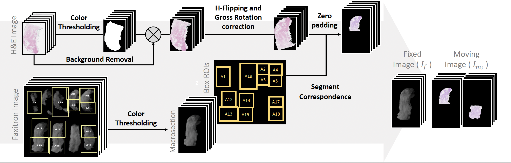
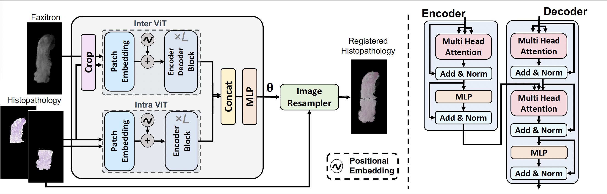

# PViT-AIR: Puzzling Vision Transformer-based Affine Image Registration for Multi Histopathology and Faxitron Images of Breast Tissue
[](https://opensource.org/licenses/MIT)

This repository contains the Python implementation of the following pape:
> Golestani, N., Wang, A., Moallem, G., Bean, G. R., & Rusu, M. (2024). "PViT-AIR: Puzzling Vision Transformer-based Affine Image Registration for Multi Histopathology and Faxitron Images of Breast Tissue." .[Medical Image Analysis, Elsevier](https://doi.org/10.1016/j.media.2024.103356)

# Method
Breast cancer remains a significant global health challenge. This work introduces a novel deep learning-based method for registering multi-histopathology images to corresponding Faxitron images of breast tissue macrosections. **PViT-AIR** leverages the strengths of convolutional neural networks (CNNs) and vision transformers (ViTs) to capture local and global features, respectively, enabling efficient and accurate segment-to-macrosection alignment through a unique *puzzling-based approach*. The network trains in a weakly supervised manner, leveraging synthetic mono-modal data for training while supporting multi-modal data during testing. 

#### Key Features
 - **Affine Registration** of histopathology and Faxitron images, capturing multi-modal and high-variance data efficiently.
 - **Segment-to-Macrosection Registration** using a puzzling-based mechanism, which aligns multiple histopathology segments to a single Faxitron macrosection image.
 - **Weakly Supervised Learning** with synthetic mono-modal data, enabling multi-modal testing without direct multi-modal ground truth.
 - **Performance Evaluation** with new stitching and alignment metrics to ensure accurate and consistent registration.


<center>
<figure>
    
    <figcaption>Data preprocessing pipeline for histopathology and faxitron images.</figcaption>
</figure>
</center>

<br>
<br>

<center>
<figure>
    
    <figcaption>PViT-AIR network architecture for estimating affine transformation parameters of input data with multiple moving images and generating the composite image.</figcaption>
</figure>
</center>


# Data Preparation

The CSV file containing training data should contain the following columns:

| **Column Name**    | **Description** |
|--------------------|-----------------|
| `subject`          | The label for the corresponding data sample (e.g., class or category of the image). |
| `target_image`     | The path to the target image. |
| `target_mask`      | The path to the mask corresponding to the target image. This mask helps the model learn which parts of the target image are relevant. |
| `source_image`     | The path to the segment of the source image. This is a segmented image that will be warped to aligs the target image. |
| `source_mask`      | The path to the mask corresponding to the source image. This mask indicates the region of interest in the source image. |


## Multiple Rows Per Sample
Each sample may contain multiple rows in the CSV file. This is due to the use of multiple segments for each sample. For example, if a data sample has two segments (source and target), the CSV will contain two rows for that sample, where each row corresponds to one segment of the sample.
 
### Example
| **subject** |        **target_image**       |        **target_mask**        |        **source_image**        |       **source_mask**         |
|-------------|-------------------------------|-------------------------------|--------------------------------|-------------------------------|
| 0           | `/path/to/target_image_1.jpg` | `/path/to/target_mask_1.png`  | `/path/to/source_image_11.jpg` | `/path/to/source_mask_11.png` |
| 0           | `/path/to/target_image_1.jpg` | `/path/to/target_mask_1.png`  | `/path/to/source_image_12.jpg` | `/path/to/source_mask_12.png` |
| 1           | `/path/to/target_image_2.jpg` | `/path/to/target_mask_2.png`  | `/path/to/source_image_21.jpg` | `/path/to/source_mask_21.png` |
| 1           | `/path/to/target_image_2.jpg` | `/path/to/target_mask_2.png`  | `/path/to/source_image_22.jpg` | `/path/to/source_mask_22.png` |
In this example:
- The sample with `subject = 0` includes two rows, each representing target image and one of its correpsonding segments.
- The first row corresponds to the first segment, and the second row corresponds to the second segment.
- The labels (`subject`) for each segment are the same, as they belong to the same data sample.


# Setup

**Clone the repository**
   ```bash
git clone https://github.com/username/PViT-AIR.git
cd PViT-AIR
```
**Install required packages**
```bash
conda create -n pvitair python=3.10 pip
conda activate pvitair
pip install -r requirements.txt
```

# Training
Run the script to train registration model on your dataset:
```bash
python train.py \
        --dataset path/to/train/dataset/csv \
        --save_dir path/to/checkpoint/directory \
        [OPTIONS]
```

# Evaluation
After training, run the test script to evaluate the performance of affine registration model:
```bash
python test.py \
        --dataset path/to/test/dataset/csv \
        --checkpoint path/to/checkpoint/directory \
        --save_dir path/to/save/directory \
        [OPTIONS]
```

 
# Citation
If you find this repository useful, please consider citing our paper:
```bibtex
@article{golestani2024pvit,
  title={PViT-AIR: Puzzling vision transformer-based affine image registration for multi histopathology and faxitron images of breast tissue},
  author={Golestani, Negar and Wang, Aihui and Moallem, Golnaz and Bean, Gregory R and Rusu, Mirabela},
  journal={Medical Image Analysis},
  pages={103356},
  year={2024},
  publisher={Elsevier}
}
```

### Contact
For questions or issues, please create an issue on this repository or contact us at [negar.golestani@mssm.edu](mailto:negar.golestani@mssm.edu).
# PViT-AIR
